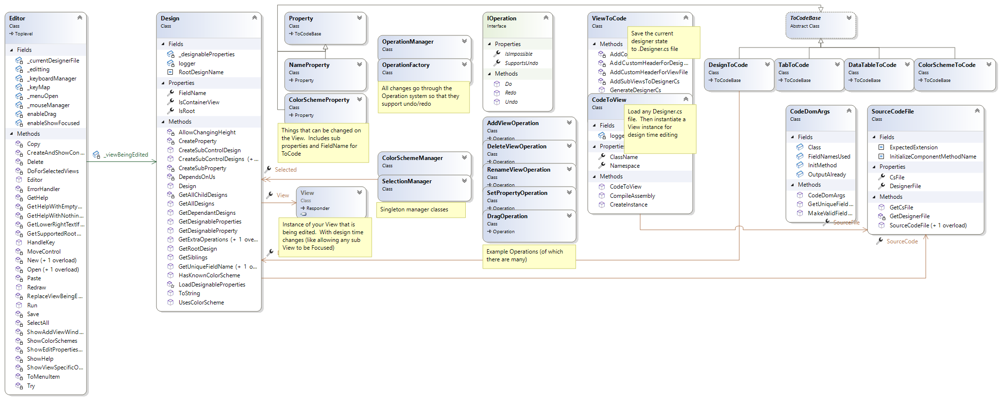

# Terminal Gui Designer

 [](https://www.nuget.org/packages/TerminalGuiDesigner/)


Cross platform designer for [Terminal.Gui](https://github.com/migueldeicaza/gui.cs) applications.  

Built with CodeDom and Roslyn, TerminalGuiDesigner lets you create complicated Views with drag and drop just like the WinForms designer you know and love (or hate).

Install the tool from NuGet or follow the [Hello World Tutorial](./README.md#usage):
```
dotnet tool install --global TerminalGuiDesigner
```

Update to the latest version using
```
dotnet tool update --global TerminalGuiDesigner
```

This project is in alpha.  See the [feature list](./README.md#features) for progress.


### Building
----------------
Build using the dotnet 6.0 sdk
```
cd src
dotnet run
```

### Usage
------------------
Install the dotnet sdk and create a new console application with references to Terminal.Gui.  Install the TerminalGuiDesigner and create a new dialog:
```
dotnet new console -n hello
cd hello
dotnet add package Terminal.Gui
dotnet tool install --global TerminalGuiDesigner
TerminalGuiDesigner MyDialog.cs
```

Enter a namespace then add a Button to the view.  Save with Ctrl+S.  Exit the designer with Ctrl+Q.

Enter the following into Program.cs

```csharp
using Terminal.Gui;

Application.Init();

Application.Run(new YourNamespace.MyDialog());

Application.Shutdown();
```

Run your program with 
`dotnet run`

You can add new code to `MyDialog.cs` but avoid making any changes to `MyDialog.Designer.cs` as this will be rewritten when saving.

For example in `MyDialog.cs` after `InitializeComponent()` add the following:

```csharp
button1.Clicked += ()=>MessageBox.Query("Hello","Hello World","Ok");
```
Now when run clicking the button will trigger a message box.


You can re-open the designer by running it from the command line with the file you want to edit/create.

```
TerminalGuiDesigner MyDialog.cs
```

You can remove the tool using the following:

```
dotnet tool uninstall --global TerminalGuiDesigner
```

### Keybindings & Controls
----------------
You can change keybindings by copying [Keys.yaml](https://raw.githubusercontent.com/tznind/TerminalGuiDesigner/main/src/Keys.yaml) into your current directory.

To edit MenuBar items use the following controls

| Key          |  Action |
|--------------|------------|
| Shift Up/Down | Move selected menu item up/down|
| Shift Right   | Move selected menu item to a submenu of the one above |
| Shift Left    | Move selected sub menu item up a level |
| Del    | Remove selected menu item |
| Enter    | Add a new menu item |
| Typing    | Edit the Title of the selected item |

New root level menus can be added by right clicking the `MenuBar` and selecting 'Add Menu'.

Currently there is no support for custom field naming (i.e. `(Name)`) or assigning shortcuts to menu items but this is planned for the future.

### Features
-------------------------------

The following feature list shows the current capabilities and the roadmap

- [ ] Design classes 
    - [x] Window
    - [x] Dialog
    - [ ] View
    - [ ] Top level (with statusbar and or menu)
- [x] Configure root properties (e.g. Window.Width, Title etc)
- [ ] Configure subview properties
    - [x] (Name)
    - [x] X/Y
    - [x] Width/Height
    - [x] Text
    - [ ] Color Schemes
- [x] Mouse Input
  - [x] Drag to move
  - [x] Drag into/out of sub view
  - [x] Drag to resize
- [x] Undo/Redo
- [x] Direct editing of Text just by typing
- [x] Easy Menu Bar Designing
  - [x] Create new items
  - [x] Move items
  - [x] Move in/out of submenus
  - [x] Add menu bar separators (Type '---')
  - [ ] Assign shortcuts
  - [ ] Set fieldnames `(Name)`
- [ ] Easy Status Bar Designing
- [ ] Create Events e.g. MyButton_OnClick
- [ ] Mutli select (select many views and hit delete or drag move)
- [ ] Copy/Paste 
  - [x] Single view
  - [ ] Multiple views at onces
- [ ] Move views to subviews
  - [x] With mouse
  - [ ] With keyboard
- [ ] Read and present xmldoc comments when editing properties
- [ ] Dev Environment Integration
  - [ ] Visual Studio plugin (e.g. right click a .Designer.cs to open in TerminalGuiDesigner console)
  - [ ] Visual Studio Code plugin 
- [x] Comprehensive Tests
- [x] CI
- [ ] Create and edit all views
  - [x] Button
  - [x] Checkbox
  - [x] ComboBox
  - [x] DateField
  - [x] FrameView
  - [x] GraphView
  - [x] HexView
  - [x] Label
  - [x] LineView
  - [x] ListView
  - [x] MenuBar
  - [ ] PanelView
  - [x] ProgressBar
  - [x] RadioGroup
  - [ ] StatusBar
  - [x] TableView
  - [x] TabView
  - [x] TextField
  - [x] TextValidateField
  - [x] TextView
  - [x] TimeField
  - [x] TreeView
  - [ ] View

### Class Diagram
-------------------------------

